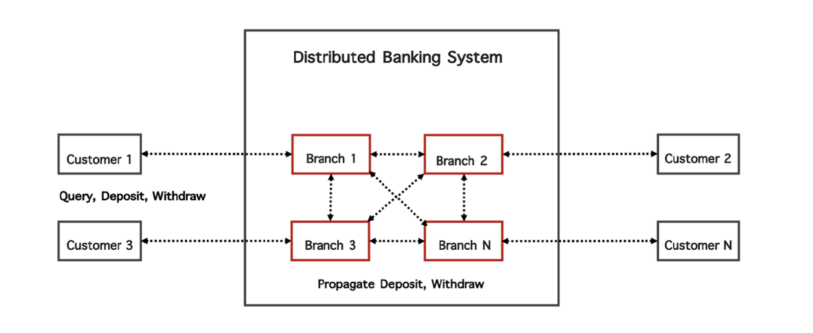

# Logical Clock Project

## Overview

This project extends upon a distributed banking system to implement Lamport’s logical clock algorithm, ensuring event ordering across multiple customer and branch processes. By incorporating logical clocks, the system coordinates actions based on the "happens-before" relationship, maintaining consistency and order of transactions in a distributed environment.




Installation Steps:

1. Install Python 3.11.X

```bash
$ sudo add-apt-repository ppa:deadsnakes/ppa
```

```bash
$ sudo apt update
```

```bash
$ sudo apt install python3
```

To verify the installation

```bash
$ python3 --version
```

1. Install Python Package manager

```bash
$ sudo apt install python3-pip
```

1. Install Python virtual environment and activate it

```bash
$ sudo apt install python3-virtualenv
$ virtualenv venv
$ source venv/bin/activate
> (venv) user@user: ~path
$ python -m pip install --upgrade pip
```

1. Install requirements
    1. After activating your virtual environment run the following commands
    
    ```bash
    $ pip3 install -r requirements.txt
    ```
    
2. Run the script using from file `main.py`
    
    ```bash
    $ python3 main.py <file_path>
    ```
    
    Example:
    
    ```protobuf
    $ python3 main.py input.json
    ```
    
    This starts the server and all the Branch and Customer objects are instantiated with the data provided in `input.json` and the processes are started.
    
3. Results are stored
    1. Customer outputs → `customer_outputs.json`
    2. Branch outputs → `branch_outputs.json`
    3. Event outputs → `event_outputs.json`
4. Customer processes debug logs are stored in `customerDebug.txt`
5. Branch processes debug logs are stored in `branchDebug.txt`